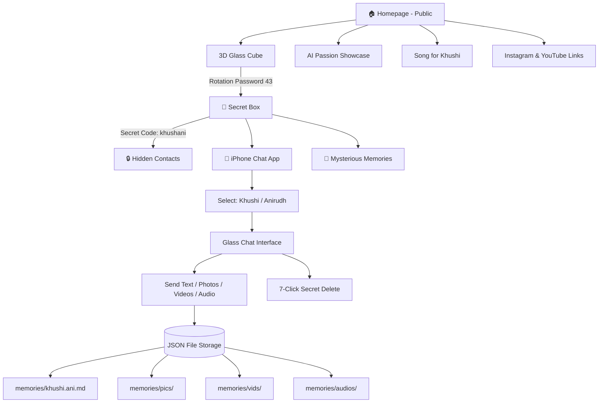

# 💜 Khushi AI Paglu — Website Implementation Plan

A mysterious, warm, and beautifully crafted website that celebrates Khushi's passion for AI while hiding a world of secrets only two people can unlock.

---

## User Review Required

> [!IMPORTANT]
> **Privacy First**: Your Telegram (`https://t.me/Anirudhsq`) and WhatsApp (`9860730275`) are ONLY visible after entering secret code `khushani`. They are never in the HTML source — loaded dynamically via PHP API after server-side code verification.

> [!IMPORTANT]
> **3D Cube Password**: The rotation password `43` (4 lines top, 3 lines bottom) is the gateway to the secret box. This is NOT stored in client-side JS — verified server-side via PHP.

> [!WARNING]
> **Chat Storage**: All chat messages are stored as JSON files on your server. Anyone with FTP/server access could read them. Consider this when hosting.

---

## Architecture Overview



---

## Proposed Changes

### 🎨 Design System

- **Colors**: Purple (`#9333EA`), Pink (`#EC4899`), Black (`#0A0A0F`) with glassmorphism
- **Fonts**: "Outfit" (headings), "Inter" (body), "Caveat" (handwritten/song lyrics) from Google Fonts
- **Effects**: Glassmorphism, 3D CSS transforms, particle animations, subtle glow effects
- **Theme**: Dark mode base with purple/pink neon accents — mysterious, premium, warm

---

### Component 1: Public Homepage

#### [NEW] [index.html](file:///c:/Users/asus/OneDrive/Desktop/Khushi%20Ai%20paglu/index.html)
- Hero section with "Khushi AI Paglu 😊" title
- Khushi portrait sketch (AI-generated artistic sketch)
- AI passion showcase section with animated cards
- Highlighted quote: "You are my fav AI paglu forever"
- Song lyrics section (warm AI-themed song mentioning Khushi & "Artist")
- Social links: Instagram & YouTube (public)
- **3D Glass Cube** in center — the secret gateway
- Rotation counter bars (top & bottom, subtle)

#### [NEW] [css/style.css](file:///c:/Users/asus/OneDrive/Desktop/Khushi%20Ai%20paglu/css/style.css)
- Complete design system with CSS custom properties
- Glassmorphism utilities
- Animations (float, glow, pulse, rotate)
- Responsive breakpoints
- 3D cube styles
- Chat interface styles (iPhone theme)

#### [NEW] [js/app.js](file:///c:/Users/asus/OneDrive/Desktop/Khushi%20Ai%20paglu/js/app.js)
- 3D cube rotation with touch/mouse drag
- Line counter system (top/bottom bars)
- Password verification (4 top, 3 bottom = "43")
- Particle background animation
- Smooth scroll and section animations
- Secret code input modal

---

### Component 2: 3D Glass Cube & Password System

**How the password works:**
1. User sees a slowly rotating 3D glass cube in the center of homepage
2. They can drag/swipe RIGHT → adds a line to the TOP bar
3. They can drag/swipe LEFT → adds a line to the BOTTOM bar
4. Password is `43`: 4 lines on top (||||) + 3 lines on bottom (|||)
5. Lines appear as subtle glowing marks — look decorative, not like a password
6. On correct combination → cube "unlocks" with animation → reveals secret box
7. Wrong combo after 7 lines total → reset with subtle shake

#### [NEW] [js/cube.js](file:///c:/Users/asus/OneDrive/Desktop/Khushi%20Ai%20paglu/js/cube.js)
- CSS 3D transforms for glass cube
- Touch and mouse drag handlers
- Line counter logic
- Password verification via API call
- Unlock animation sequence

---

### Component 3: Secret Box (Post-Password)

#### [NEW] [secret.html](file:///c:/Users/asus/OneDrive/Desktop/Khushi%20Ai%20paglu/secret.html)
- Accessed only after correct cube password
- Session-based access (PHP session verification)
- Contains:
  - 💬 **Chat App** (iPhone-themed) — PRIMARY feature
  - 🔐 **Secret Code Input** for hidden contacts
  - 💝 **Memory Lane** — shared moments viewer
  - ✨ **Mysterious surprises** (countdown, constellation map of important dates, secret notes)

---

### Component 4: iPhone Chat App

#### [NEW] [chat.html](file:///c:/Users/asus/OneDrive/Desktop/Khushi%20Ai%20paglu/chat.html)
- Entry screen: "I'm Khushi" / "I'm Anirudh" selection
- Desktop: 3D iPhone frame containing the chat
- Mobile: Full screen chat interface
- Features:
  - Real-time message display (polling every 2 seconds)
  - Text messages with timestamps
  - Photo/video/audio sharing
  - Glass effect message bubbles
  - Messages slightly wobble on hover
  - Blush animation on click
  - **7-click delete** (secret — no visual indicator)

#### [NEW] [js/chat.js](file:///c:/Users/asus/OneDrive/Desktop/Khushi%20Ai%20paglu/js/chat.js)
- Message sending/receiving
- File upload handling
- Click counter for secret delete (7 clicks)
- Auto-scroll to latest message
- Typing indicators
- Message animations (wobble, blush)

#### [NEW] [css/chat.css](file:///c:/Users/asus/OneDrive/Desktop/Khushi%20Ai%20paglu/css/chat.css)
- iPhone frame 3D CSS
- Glass effect message bubbles
- Purple (Khushi) / Pink (Anirudh) message colors
- Animations: slide-in, wobble, blush glow

---

### Component 5: PHP Backend & JSON Storage

#### [NEW] [api/chat.php](file:///c:/Users/asus/OneDrive/Desktop/Khushi%20Ai%20paglu/api/chat.php)
- `POST /api/chat.php?action=send` — Send message (text/media)
- `GET /api/chat.php?action=fetch&after=timestamp` — Fetch new messages
- `POST /api/chat.php?action=delete&id=xxx&user=anirudh` — Delete message (Anirudh only)
- Messages stored in `data/messages.json`
- Media files saved to respective `memories/` subdirectories

#### [NEW] [api/auth.php](file:///c:/Users/asus/OneDrive/Desktop/Khushi%20Ai%20paglu/api/auth.php)
- `POST /api/auth.php?action=verify_password` — Verify cube password (43)
- `POST /api/auth.php?action=verify_secret` — Verify secret code (khushani)
- Returns hidden contact info ONLY on correct secret code
- Sets PHP session for authenticated access

#### [NEW] [api/upload.php](file:///c:/Users/asus/OneDrive/Desktop/Khushi%20Ai%20paglu/api/upload.php)
- Handles file uploads (images, videos, audio)
- Validates file types and sizes
- Saves to `memories/pics/`, `memories/vids/`, `memories/audios/`
- Returns file URL for chat message

---

### Component 6: Data Storage

#### [NEW] [data/messages.json](file:///c:/Users/asus/OneDrive/Desktop/Khushi%20Ai%20paglu/data/messages.json)
```json
{
  "messages": [
    {
      "id": "uuid",
      "sender": "khushi|anirudh",
      "type": "text|image|video|audio",
      "content": "message text or file path",
      "timestamp": "2026-04-07T23:00:00+05:30",
      "deleted": false
    }
  ]
}
```

#### [NEW] [memories/khushi.ani.md](file:///c:/Users/asus/OneDrive/Desktop/Khushi%20Ai%20paglu/memories/khushi.ani.md)
- Auto-generated markdown log of all conversations
- Updated on each new message

---

## File Structure

```
Khushi Ai paglu/
├── index.html              # Public homepage
├── secret.html             # Secret box (post-password)
├── chat.html               # iPhone chat app
├── css/
│   ├── style.css           # Main styles + design system
│   └── chat.css            # Chat-specific styles
├── js/
│   ├── app.js              # Homepage logic + particles
│   ├── cube.js             # 3D cube + password system
│   └── chat.js             # Chat functionality
├── api/
│   ├── chat.php            # Chat API
│   ├── auth.php            # Authentication API
│   └── upload.php          # File upload handler
├── data/
│   └── messages.json       # Chat storage
├── memories/
│   ├── khushi.ani.md       # Chat log
│   ├── pics/               # Shared photos
│   ├── vids/               # Shared videos
│   └── audios/             # Shared audio
└── assets/
    └── images/
        └── khushi-sketch.webp  # Generated portrait sketch
```

---

## Secret Box Mysteries (Inside the Cube)

After unlocking with password `43`, the secret box reveals:

1. **💬 Our Chat** — iPhone-themed private messaging (PRIMARY)
2. **🌟 Constellation** — Interactive star map where each star is a special date/memory
3. **🎵 Our Song** — The AI song plays with animated lyrics
4. **🔐 Secret Vault** — Enter "khushani" to see private contact info
5. **💌 Love Letters** — Anirudh can leave surprise notes that Khushi discovers

---

## Open Questions

> [!IMPORTANT]
> 1. **Hosting**: Will this be hosted on a PHP web server (like cPanel/public_html)? I need to know for file path configuration.
> 2. **Portrait Style**: Should Khushi's portrait sketch be anime-style, realistic pencil sketch, or digital art style?
> 3. **Song Style**: You mentioned "warm like Anuj Jain" — should I write soft indie/acoustic style lyrics?

---

## Verification Plan

### Automated Tests
- Test 3D cube rotation and password system in browser
- Test chat message send/receive flow
- Test file upload for images/videos/audio
- Test secret code verification
- Test 7-click delete functionality
- Test responsive design (desktop 3D iPhone vs mobile full screen)

### Manual Verification
- Browser recording of full user flow
- Visual inspection of glassmorphism effects
- Mobile responsiveness testing
- Privacy check: verify no hidden data in page source
